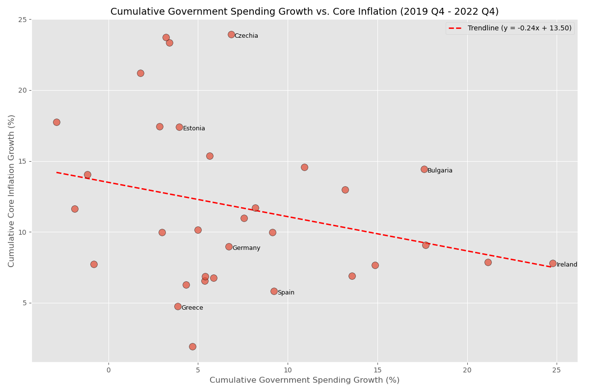
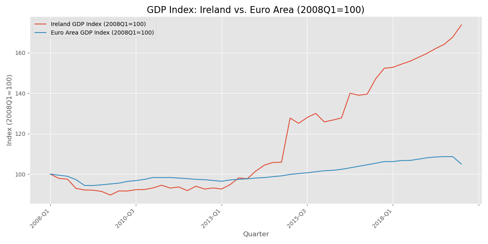
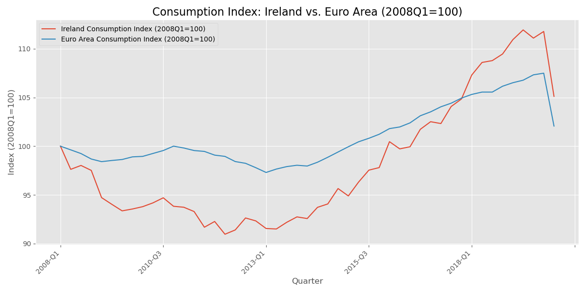

# 🇪🇺 Macro Policy Analysis: Fiscal Stimulus and Inflation in the Euro Area

## 🎯 Executive Summary & Key Findings

This project investigates the relationship between **cumulative government spending growth** and **core inflation** across Euro Area countries during the 2019-2022 period, a time characterized by large fiscal stimulus packages.

The analysis, performed using **Python (Pandas, Matplotlib, NumPy)** and Eurostat data, yields two key findings:

1.  **Cross-Country Correlation (Scatter Plot):** The analysis reveals a **weak, non-linear correlation** between cumulative government spending growth and cumulative core inflation, suggesting that country-specific fiscal decisions were likely not the dominant driver of inflation across the Euro Area.
2.  **Case Study (Line Charts):** A comparison of Ireland's GDP and domestic consumption indices versus the Euro Area average clearly illustrates the impact of **MNC activity distortion** on reported GDP, justifying the choice to use consumption-based metrics for the core inflation analysis.

---

## Key Visualizations

The core findings are summarized in the plots below.

### 1. Cumulative Spending vs. Core Inflation (2019 Q4 - 2022 Q4)

This scatter plot shows the primary finding: a diffuse relationship between a country's fiscal expansion and its inflationary experience.



### 2. Irish Case Study: GDP vs. Consumption Indices

This comparison highlights the importance of data context and cleaning in macro analysis. Ireland's GDP index (blue line) is distorted by multinational firm activities, while the Consumption Index (red line) better reflects the domestic economy.

| Irish GDP Index vs. Euro Area | Irish Consumption Index vs. Euro Area |
| :---: | :---: |
|  |  |

---

## 🛠️ Technical Details & Reproducibility

This project is fully reproducible and was conducted in Python.

### Data Sources
All macroeconomic data, including GDP components, HICP (Inflation), and national accounts indices, were sourced from **Eurostat**. The raw data is located in the `/data` directory.

### Project Files
* **`analyze_macro_data.py`**: The main Python script that handles data loading, cleaning, manipulation, calculation of cumulative growth rates, and generation of all three output plots.
* **`/data`**: Contains the raw CSV inputs.
* **`requirements.txt`**: Lists all necessary Python packages.
* **`*.png`**: The final output visualizations embedded above.

### Environment Setup & Running the Analysis

To replicate the project environment and analysis locally, follow these steps:

1.  **Clone the Repository:**
    ```bash
    git clone [https://github.com/Mahir-100/Macro_Policy_Analysis_EU.git](https://github.com/Mahir-100/Macro_Policy_Analysis_EU.git)
    cd Macro_Policy_Analysis_EU
    ```

2.  **Install Dependencies:** (Assumes you have Python and pip installed)
    ```bash
    pip install -r requirements.txt
    ```

3.  **Run the Analysis Script:**
    ```bash
    python analyze_macro_data.py
    ```
    This script will execute the analysis and generate the three `.png` files in the root directory.

---

## 📈 Skills Demonstrated

* **Data Analysis & Cleaning (Pandas):** Handling real-world, messy macroeconomic data (Eurostat CSVs), performing necessary clean-up, and calculating time-series metrics (cumulative growth, indexing).
* **Statistical Visualization (Matplotlib):** Creating professional scatter plots with trendlines and informative line charts for time-series comparison.
* **Macroeconomic Context:** Applying core economic knowledge to interpret data (e.g., Irish GDP/GNP distortion) and structure the analysis.
* **Reproducibility (Git & GitHub):** Version control and providing a clear pathway for others to replicate the final results.